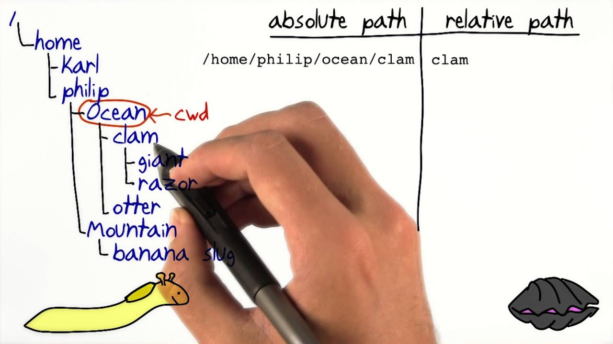
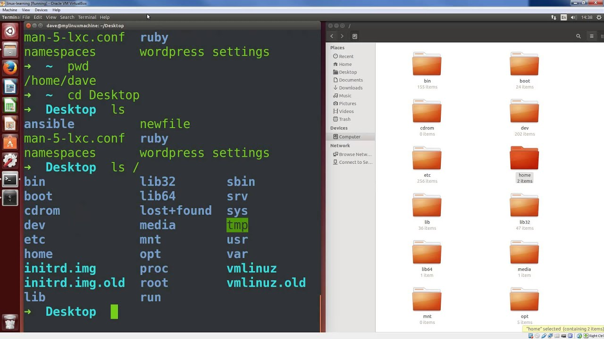

# The command line

## Introduction

In this course, we will be using the command line with our projects. When you use Finder or Windows Explorer on your computer, you are using a GUI, or graphical user interface. When you use the Terminal or Command Prompt, you are using a CLI, or command line interface. While a GUI is great for day to day use, the CLI provides more flexibility, options, and speed for programming tasks.

If you are using Mac, feel free to use Terminal, iTerm, or your terminal app of choice.

If you are using Windows, use a terminal emulator like Cmder or Windows Subsystem for Linux (WSL).

## Paths

[](https://www.youtube.com/watch?v=ephId3mYu9o)
_Absolute paths on [YouTube](https://www.youtube.com/watch?v=ephId3mYu9o)_

Start with your terminal app open. Type the command `pwd` and run it with `enter` to print the path to your current working directory. This command returns an absolute path to the folder you are currently in:

```
/Users/USERNAME
```

An absolute path starts at the root `/` of the file system and contains the full path through every folder to the desired location. Absolute paths are brittle and prone to breaking whenever a folder or file location changes.

The terminal defaults to your home directory, also referred to as `~`, whose absolute path is `/Users/myusername`. If you are not in your home directory, run `cd ~` to change directories into your hope directory. To list the files in your home directory, run `ls`.

Let’s switch to our downloads folder via relative paths with `cd Downloads` and run `ls` to list its contents. Relative paths are based on your current working directory. To move up a folder, run `cd ..` and you will find yourself back in the home directory.

Many terminal commands have additional options called flags. Try running `ls -l` and you will find additional folder and file metadata printed to the screen. Running `ls -a` will include hidden files. You can run both at the same time with `ls -la` or `ls -l -a`.

Practice navigating around your computer with the terminal using absolute and relative paths.

## Commands

[](https://www.youtube.com/watch?v=id3DGvljhT4)
_Commands on [YouTube](https://www.youtube.com/watch?v=id3DGvljhT4)_

```bash
# this is a bash comment

# print working directory (folder)
pwd

# list files and directories
ls

# change directory
cd
cd ~ # home (/Users/USERNAME)
cd / # root
cd .. # relative path, up a folder
cd folder # relative path, down a folder
cd /Users/USERNAME/Downloads # absolute path

# create or update file
touch file.txt

# remove a file
rm file.txt # careful, permanently deleted

# create folder
mkdir folder

# remove a folder
rm -rf folder # careful, permanently deleted

# ctrl+c kill process
```

## Practice

Using only commands in your terminal:

- Create a folder in your downloads file called `tracecamp-cli-Practice`
- Inside that folder, create:
  - `example.txt`
  - `helloworld.txt`
- List all the files in the `tracecamp-cli-Practice` directory
- Delete the `example.txt` file
- Delete both the `tracecamp-cli-Practice` and `helloworld.txt` at the same time

## Optional

- [Cheat sheet](https://gist.github.com/LeCoupa/122b12050f5fb267e75f) of helpful commands
- Other very helpful commands include `echo`, `mv`, `cp`, `man`, and many more
- Tab auto completion
- Bash vs Zsh
- bashrc/zshrc files
- Write custom bash aliases
- Write custom functions
- Learn terminal editors, such as `nano`
- Install an app like `cd to`
- Install helpful dotfiles, like
  - https://github.com/wesbos/dotfiles
  - https://github.com/mattjmorrison/dotfiles

## [Next lesson →](./02-installation.md)
