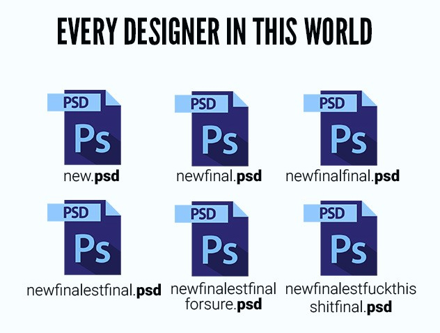

# Git

When writing papers or making projects, you may end up with a folder like this:



Git is version control. Version control helps you collaborate with others, keep track of changes, and backup your work (so you can always go back to a previous version when something breaks). GitHub is where your git repository (project) lives online. There are many benefits to Git and GitHub, such as online collaboration, nonlinear editing, advanced workflows, and more, which are outside the scope of this course. Our minimum requirement is for you to be able to save all your project code online. We strongly recommend watching additional [tutorials](https://www.youtube.com/watch?v=9GKpbI1siow&list=PLpcSpRrAaOarEpNz71TSfNVd0eQmsZSgN) to learn more about Git and GitHub.

## Gitignore

There may be files containing sensitive data that you don’t want online. Or, you may have many dependencies that you don’t need stored with your project. The `.gitignore` file lives in your project root folder, and specifies files and folders to ignore. Many frameworks come with their own specialized `.gitignore` file. For common configs, check out [gitignore.io](https://www.toptal.com/developers/gitignore) and type in `windows`, `linux`, `macOS`, `Node`, and more.

## Common commands

### Setup

```bash
# inside your project folder
cd ~/Desktop/tracecamp/project

# create a new git repository (project)
git init

# ignore dependencies and sensitive files
touch .gitignore

# add everything else
git add -A

# check what has been added
git status

# save changes with a message
git commit -m "feat: initial commit"

# in github, create a new repo and copy the lines for the second option
# …or push an existing repository from the command line
git remote origin add https://github.com/USERNAME/PROJECT.git
git branch -M main
git push -u origin main

# refresh the browser to see your uploaded code
```

### Changes

While it is possible only to push your project once at the very end, we encourage you to continually push new changes to GitHub throughout the day. To save your changes, follow these steps:

```bash
# check for any new changes
git pull

# stage your changes
git add -A

# double check
git status

# save your changes
git commit -m "feat: new feature added"

# push changes online
git push
```

## Semantics

While git commits may have any message, we recommend using [semantic commit messages](https://gist.github.com/joshbuchea/6f47e86d2510bce28f8e7f42ae84c716). By prefixing your messages with `feat: added feature name`, `fix: annoying bug name`, and more, it will make your changes clearer and encourage you to space your changes into multiple commits.

## Practice

Try it out!

- Create a new project folder
- Create a `README.md` file with `Hello World!` inside
- Create an `example.txt` with `Practicing Git!` inside
- Add at least two subfolders with a file inside each
- Create a gitignore that ignores one of those folders and the `example.txt` file

## Optional

- [Intro tutorial](https://www.youtube.com/watch?v=9GKpbI1siow&list=PLpcSpRrAaOarEpNz71TSfNVd0eQmsZSgN)
- [GitHub Glossary](https://docs.github.com/en/free-pro-team@latest/github/getting-started-with-github/github-glossary)
- [Advanced tutorial](https://pro.academind.com/p/git-github-the-practical-guide)
- npm husky
- npm prettier
- npm eslint
- CI/CD

## [Next lesson →](./04-internet.md)
