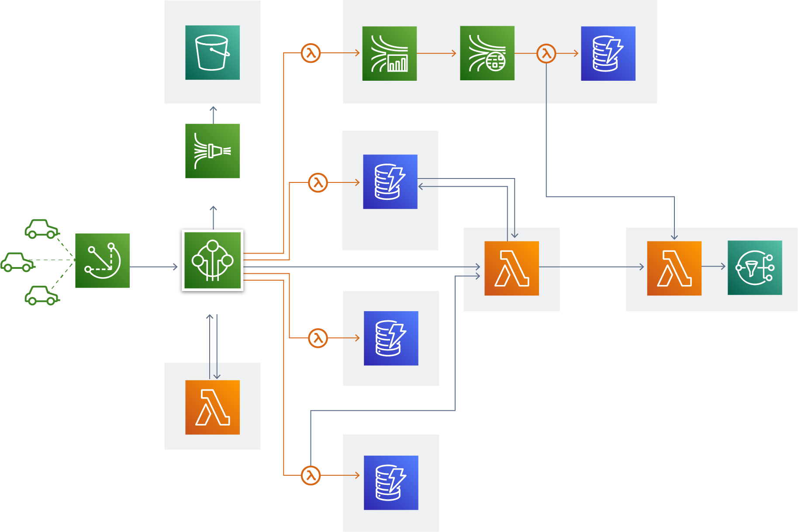

# How the internet works



_This big scary diagram is not how the internet works. It’s random Amazon Web Services icons and arrows. [Credit](https://aws.amazon.com/architecture/icons/)_

## The Internet

According to wikipedia, “The Internet is the global system of interconnected computer networks”. Oversimplified, the internet is made of computers that talk to one another.

In your home, your computer is connected to your WiFi router. That is your local network. Your WiFi router connects to your ISP (Internet Service Provider, such as Comcast, Spectrum, AT&T). These internet service providers connect you to their networks, which connect to even larger networks. Summed up, the Internet is made of these decentralized networks of networks.

## IP addresses

Every computer connected to the internet—your laptop, servers, smart toasters—they all have IP addresses. For example, `92.119.17.13`. These IP addresses are unique identifying numbers, specific to each device.

However, these ip addresses are not easy for people to remember. Domain names, such as google.com, are a way to connect to these ip addresses (other devices on the network) automatically.

To demonstrate, run this command in your terminal to find Google’s IP address:

```bash
nslookup google.com

# Name:	google.com
# Address: 142.250.9.138
```

A DNS, or domain name server, is the server that converts your domain name into an IP address.

## Localhost

On your machine, localhost is a loopback to your machine itself. Localhost, or `127.0.0.1`, is your own computer.

`localhost:3000` is port 3000 on your machine. A port is a communication endpoint on your computer. When making an http request to a url, such as `http://google.com`, you are using the default port for the http protocol, port 80.

A protocol is a set of rules and standards that allow computers to talk with one another. `http` and `https` are common communication protocols used for accessing websites.

## Practice

- Find the IP address to your favorite site with `nslookup`
- Copy and paste that IP address into your web browser (Google Chrome, Firefox, Safari)
- Find your the public facing IP address assigned to your computer (what is my ip?)

## Optional

- Static vs dynamic IP addresses
- IPv4 vs IPv6
- Firewalls
- Private network
- Subnet mask
- ICANN
- Common protocols, such as http, https, ftp, sftp, and more
- TCP and UDP
- Packets
- Geocoding and geofencing
- Privacy concerns, VPNs, TOR, and IP blocking

## [Next lesson →](./05-frontend-vs-backend.md)
