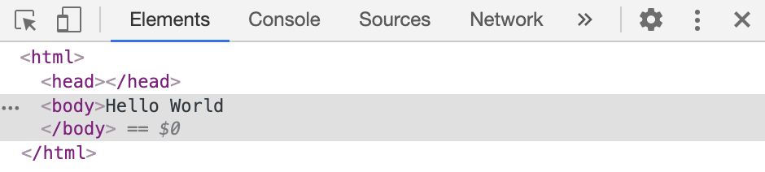
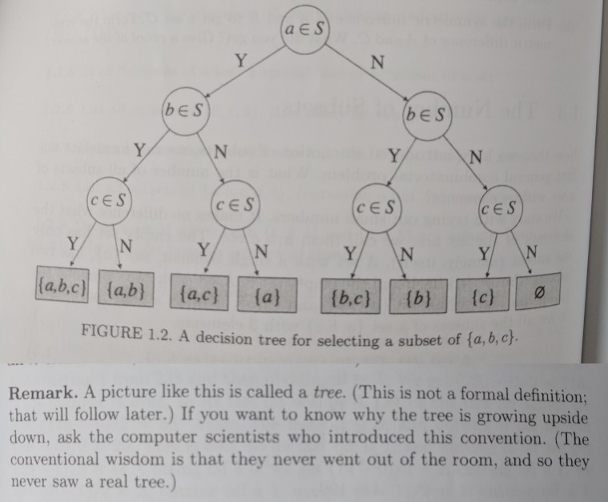

# HTML

All webpages are loaded in the browser as html files. HTML is a markup language, which uses annotations to describe the structure of a document and organizes the types of content within it.

Let’s make your first webpage! In your text editor, create an `index.html` file with the content:

```html
Hello World!
```

That’s it! You’ve made your first webpage.

## The DOM

Drag your html file into your web browser or type `open index.html` in your terminal. In the browser, open your `View > Developer > Developer Tools`. Memorize that keyboard shortcut!

In the elements tab, you’ll find:

```html
<html>
  <head></head>
  <body>
    Hello World
  </body>
</html>
```



When a browser parses (reads) invalid html, it will attempt to fail gracefully. The DOM (Document Object Model) is the representation returned from the browser parsing your html. The DOM API is what allows JavaScript to add interactivity and change the webpage contents and styling you see on the screen.

## HTML Elements

The `html`, `head`, and `body` are called html elements. Each html tag has an opening tag `<body>` and a closing tag `</body>`.

Some html elements, like img tags, don't require a closing tag ``. I always recommend closing the tag, as code we will write later in the course requires it.

Other html elements, like input tags, have self closing tags `<input type="text" />`.

## Standard Elements

Every valid webpage must have `html`, `head`, and `body` tags. Here is the default webpage template from emmet:

```html
<!DOCTYPE html>
<html lang="en">
  <head>
    <meta charset="UTF-8" />
    <meta name="viewport" content="width=device-width, initial-scale=1.0" />
    <title>Document</title>
  </head>
  <body></body>
</html>
```

You’ll notice that some html tags have additional content called attributes. Each attribute has a name and a value `name="value"`. Boolean attributes just have the `name`. Text and elements inside html tags are called content `<title>content</title>`.

Often, tags that go in the head are metadata. Metadata includes data for search engines, links to styles and scripts, and other information not displayed on the webpage.

Often, tags that go in the body are displayed in the webpage. Let’s add a heading `<h1>Hello World!</h1>` inside the body tags. There are many html tags, and I encourage you to research and learn more on your own.

## Relationships

The DOM from the parsed html code is a tree structure. A tree is data structure made of nodes and connected by edges. In a tree, the node at the start is called the root.



In HTML, the nodes are html elements and the edges are their relationship to one another. Let’s take a look at this example:

```html
<!DOCTYPE html>
<html lang="en">
  <head>
    <!-- This is an html comment -->
    <meta charset="UTF-8" />
    <meta name="viewport" content="width=device-width, initial-scale=1.0" />
    <title>Document</title>
  </head>
  <body>
    <main>
      <section>
        <h2>Ordered list</h2>
        <ol id="my-list">
          <li>One</li>
          <li class="highlight">Two</li>
          <li>Three</li>
        </ol>
      </section>
    </main>
  </body>
</html>
```

- The root is the html tag
- The html tag has two children, the head and body tags
- The head tag also has children, such as the title tag
- The title tag is a descendant of the html tag
- The html tag is an ancestor of the title tag
- The li tags are siblings to one another
- The meta and title tags are also siblings to one another

The elements in html family tree can be referred to as parents, children, ancestors, descendants, and siblings. The meanings will change based on the context of which element you are talking about.

## Accessibility

At the end of the day, all html tags displayed on a webpage are rectangles. However, screen readers and other accessibility tools depend on the html tag to organize the webpage content for those with disabilities. Common tags like `div` and `span` provide no context to the screen reader. Semantic tags like `header` and `nav` help the screen reader understand what content is on your webpage and organize it for the user.

While accessibility is good for accessibility’s sake, there are additional motivations. Google favors accessible sites. Government sites are required to be accessible, and the state of California mandates accessible websites.

Almost 20% of the world’s population have some type of disability.

## Practice

- Learn common html tags
  - title, meta, strong, em, h1, h2, h3, h4, h5, h6, p, ul, ol, li, img, inputs, forms, and more
- Learn common semantic tags
  - header, footer, main, nav, aside, section, article, and more
- Find, learn, and view examples of at least 20 html tags
- Build your own webpage with those html tags

## Optional

- VS Code Plugins
  - [Auto Close Tag](https://marketplace.visualstudio.com/items?itemName=formulahendry.auto-close-tag)
  - [Indent Rainbow](https://marketplace.visualstudio.com/items?itemName=oderwat.indent-rainbow)
- [All](https://developer.mozilla.org/en-US/docs/Web/HTML/Element) html elements
- Emmet
- All [head](https://github.com/joshbuchea/HEAD) elements
- Metatags, opengraph tags, and schema.org
- Lighthouse audit
- ARIA Accessibility guidelines
- Custom web components and the shadow DOM
- HTML Email with MJML

## [Next lesson →](./07-design.md)
