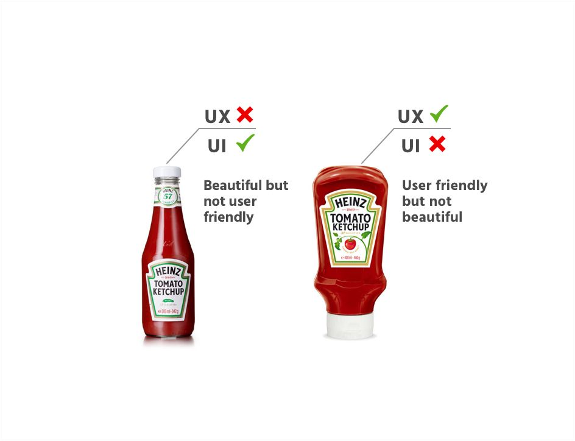

# Design resources

## About

While design is not the focus of this programming bootcamp, having a design eye will you implement beautiful user interfaces. This lesson is more of a list of resources for you to use in your projects, than a guide on how to use them.

If you are interested in learning more about design, read and watch:

- [Learn UI Design Blog](https://learnui.design/blog/)
- [Refactoring UI YouTube](https://www.youtube.com/watch?v=5gdYHlYAKDY&list=PLDVpvW8ghDr9tasku_YvuTy_l0xPUtOHE)

_Credit to [Got-It Asia](https://www.gotitasia.com/post/great-way-to-explain-the-difference-between-ux-ui-design)_

### User Interface (UI)

The form of the design. When a client says “make it look pretty”, they’re talking about UI design.

### User Experience (UX)

The function of the design. If a website is hard to use or it takes a lot of clicks to perform common task, then it has a poor UX design.

### Design systems

A design system is a set of reusable components that can be combined and reused across your site—buttons, for example. When learning React.js, we will build reusable components for our code as well.

## Reading

### Research

- [https://baymard.com/blog/archive](https://baymard.com/blog/archive)
- [https://www.nngroup.com/articles/](https://www.nngroup.com/articles/)

### Blogs

- [https://sidebar.io/](https://sidebar.io/)
- [https://uxdesign.cc/](https://uxdesign.cc/)
- [https://uxplanet.org/](https://uxplanet.org/)

### Refactoring UI

- [https://laracon.net/2018](https://laracon.net/2018)
- [https://medium.com/refactoring-ui](https://medium.com/refactoring-ui)
- [https://tailwindcss.com/docs/customizing-colors#default-color-palette](https://tailwindcss.com/docs/customizing-colors#default-color-palette)
- [https://twitter.com/steveschoger](https://twitter.com/steveschoger)
- [https://www.youtube.com/channel/UCxqiDtkXtOCNJdckODHk9YA](https://www.youtube.com/channel/UCxqiDtkXtOCNJdckODHk9YA)
- [https://www.youtube.com/watch?v=7Z9rrryIOC4](https://www.youtube.com/watch?v=7Z9rrryIOC4)

### Learn UI Design

- [https://learnui.design/blog/](https://learnui.design/blog/)

### Data density

- [https://uxdesign.cc/how-white-space-killed-an-enterprise-app-and-why-data-density-matters-b3afad6a5f2a](https://uxdesign.cc/how-white-space-killed-an-enterprise-app-and-why-data-density-matters-b3afad6a5f2a)
- [https://material.io/design/layout/applying-density.html#usage](https://material.io/design/layout/applying-density.html#usage)
- [https://www.nngroup.com/articles/modes/](https://www.nngroup.com/articles/modes/)

### Dark mode

- [https://twitter.com/steveschoger/status/1151160261170126850](https://twitter.com/steveschoger/status/1151160261170126850)
- [https://material.io/design/color/dark-theme.html](https://material.io/design/color/dark-theme.html)
- [https://darkmodedesign.xyz/](https://darkmodedesign.xyz/)
- [https://medium.com/microsoft-design/designing-dark-mode-31400530787a](https://medium.com/microsoft-design/designing-dark-mode-31400530787a)

### Miscellaneous

- [https://www.checklist.design/](https://www.checklist.design/)
- [https://medium.com/@megdraws/designing-illustrations-for-small-screens-a352a5712fa0](https://medium.com/@megdraws/designing-illustrations-for-small-screens-a352a5712fa0)
- [https://github.com/bradtraversy/design-resources-for-developers](https://github.com/bradtraversy/design-resources-for-developers)
- [Website UI Design Tutorials](https://www.youtube.com/watch?v=Ycgouilee8E&list=PLMpqQuhhJfLxszNWAmoHVUHUNsXNV3YNN)

## Resources

### Inspiration

- [http://calltoidea.com/](http://calltoidea.com/)
- [https://dribbble.com](https://dribbble.com/)
- [https://www.landingfolio.com/](https://www.landingfolio.com/)
- [https://land-book.com/](https://land-book.com/)
- [https://mobbin.design/](https://mobbin.design/)
- [https://nicelydone.club/patterns/](https://nicelydone.club/patterns/)
- [https://www.saasframe.io/](https://www.saasframe.io/)
- [https://saaslandingpage.com/](https://saaslandingpage.com/)
- [https://saaspages.xyz/](https://saaspages.xyz/)
- [https://search.muz.li/](https://search.muz.li/)
- [https://timetravel.pixelfika.com/](https://timetravel.pixelfika.com/)
- [https://uigarage.net/search/?\_sft_platform=web&\_sft_category=dashboard](https://uigarage.net/search/?_sft_platform=web&_sft_category=dashboard)
- [https://uxarchive.com/](https://uxarchive.com/)
- [https://webframe.xyz/](https://webframe.xyz/)
- [https://www.awwwards.com/](https://www.awwwards.com/)
- [https://www.behance.net/](https://www.behance.net/)
- [https://www.mobile-patterns.com/](https://www.mobile-patterns.com/)
- [https://www.niceverynice.com/components](https://www.niceverynice.com/components)
- [https://www.siteinspire.com/](https://www.siteinspire.com/)
- [https://www.uisources.com/](https://www.uisources.com/)

### UX patterns

- [https://mobbin.design/patterns](https://mobbin.design/patterns)
- [http://pttrns.com/](http://pttrns.com/)
- [https://nicelydone.club/patterns/](https://nicelydone.club/patterns/)
- [https://calltoidea.com/](https://calltoidea.com/)
- [https://www.lapa.ninja/](https://www.lapa.ninja/)
- [https://dribbble.com/](https://dribbble.com/)
- [https://designsystemchecklist.com/](https://designsystemchecklist.com/)
- [https://goodui.org/leaks/](https://goodui.org/leaks/)
- [https://www.uxtoast.com/ux-laws/](https://www.uxtoast.com/ux-laws/)

### Images

- [https://pexels.com/](https://pexels.com/)
- [https://pixabay.com/en/](https://pixabay.com/en/)
- [https://unsplash.com/](https://unsplash.com/)
  - [https://source.unsplash.com/](https://source.unsplash.com/)
  - [https://unsplash.com/documentation](https://unsplash.com/documentation)
- [https://www.si.edu/search/collection-images](https://www.si.edu/search/collection-images)

### Videos

- [https://coverr.co/](https://coverr.co/)
- [https://mixkit.co/](https://mixkit.co/)
- [https://www.pexels.com/videos/](https://www.pexels.com/videos/)

### Fonts

- [https://fonts.google.com/](https://fonts.google.com/)
- [https://www.fontsquirrel.com/](https://www.fontsquirrel.com/)
- [https://fontlibrary.org/](https://fontlibrary.org/)

### Illustrations

- [https://delesign.com/free-designs/graphics](https://delesign.com/free-designs/graphics)
- [https://www.drawkit.io/](https://www.drawkit.io/)
- [https://freeillustrations.xyz/](https://freeillustrations.xyz/)
- [https://iradesign.io/](https://iradesign.io/)
- [https://undraw.co/illustrations](https://undraw.co/illustrations)
- [https://www.openpeeps.com/](https://www.openpeeps.com/)
- [https://www.handz.design/](https://www.handz.design/)
- [https://2.flexiple.com/scale/all-illustrations](https://2.flexiple.com/scale/all-illustrations)
- [https://www.manypixels.co/gallery/](https://www.manypixels.co/gallery/)
- [https://illlustrations.co/](https://illlustrations.co/)

### Patterns

- [http://www.heropatterns.com/](http://www.heropatterns.com/)
- [https://leaverou.github.io/css3patterns/](https://leaverou.github.io/css3patterns/)
- [https://lstore.graphics/paaatterns/](https://lstore.graphics/paaatterns/)
- [https://www.toptal.com/designers/subtlepatterns/](https://www.toptal.com/designers/subtlepatterns/)
- [https://bansal.io/pattern-css](https://bansal.io/pattern-css)
- [https://www.magicpattern.design/tools/css-backgrounds](https://www.magicpattern.design/tools/css-backgrounds)
- [https://patternpad.com/](https://patternpad.com/)
- [http://patterncollect.com/](http://patterncollect.com/)
- [https://doodad.dev/pattern-generator/](https://doodad.dev/pattern-generator/)

### Gradients

- [http://davidjohnstone.net/pages/lch-lab-colour-gradient-picker](http://davidjohnstone.net/pages/lch-lab-colour-gradient-picker)
- [https://www.ls.graphics/meshgradients](https://www.ls.graphics/meshgradients)

### SVG shapes

- [https://www.shapedivider.app/](https://www.shapedivider.app/)
- [https://getwaves.io/](https://getwaves.io/)
- [https://www.blobmaker.app/](https://www.blobmaker.app/)
- [https://blobs.app/](https://blobs.app/)
- [https://trianglify.io/](https://trianglify.io/)
- [https://squircley.app/](https://squircley.app/)
- [https://svgwave.in/](https://svgwave.in/)

### Email

- [https://reallygoodemails.com/](https://reallygoodemails.com/)
- [https://www.goodemailcopy.com/](https://www.goodemailcopy.com/)
- [http://goodsalesemails.com](http://goodsalesemails.com/)
- [https://codedmails.com/](https://codedmails.com/)
- [https://hunter.io/templates](https://hunter.io/templates)

### Image minifiers

- [https://github.com/imagemin/imagemin](https://github.com/imagemin/imagemin)
- [https://github.com/svg/svgo](https://github.com/svg/svgo)

### Font minifiers

- [https://google-webfonts-helper.herokuapp.com/fonts/abeezee?subsets=latin](https://google-webfonts-helper.herokuapp.com/fonts/abeezee?subsets=latin)
- [https://github.com/ecomfe/fontmin](https://github.com/ecomfe/fontmin)

### Shadows

- [https://tailwindcss.com/docs/box-shadow/](https://tailwindcss.com/docs/box-shadow/)

### Icons

#### Free icons

- [http://www.evericons.com/](http://www.evericons.com/)
- [http://www.zondicons.com/icons.html](http://www.zondicons.com/icons.html)
- [https://akveo.github.io/eva-icons/#/](https://akveo.github.io/eva-icons/#/)
- [https://basicons.xyz/](https://basicons.xyz/)
- [https://boxicons.com/](https://boxicons.com/)
- [https://css.gg/app](https://css.gg/app)
- [https://delesign.com/free-designs/graphics/](https://delesign.com/free-designs/graphics/)
- [https://emblemicons.in/](https://emblemicons.in/)
- [https://feathericons.com/](https://feathericons.com/)
- [https://heroicons.dev/](https://heroicons.dev/)
- [https://iconmonstr.com/](https://iconmonstr.com/)
- [https://icons.getbootstrap.com/](https://icons.getbootstrap.com/)
- [https://icons.modulz.app/](https://icons.modulz.app/)
- [https://icons.mono.company/](https://icons.mono.company/)
- [https://icons.pixsellz.io/](https://icons.pixsellz.io/)
- [https://ikonate.com/](https://ikonate.com/)
- [https://illustrio.com/](https://illustrio.com/)
- [https://ionicons.com/](https://ionicons.com/)
- [https://jam-icons.com/](https://jam-icons.com/)
- [https://materialdesignicons.com/](https://materialdesignicons.com/)
- [https://phosphoricons.com/](https://phosphoricons.com/)
- [https://remixicon.com/](https://remixicon.com/)
- [https://robbiepearce.com/softies/](https://robbiepearce.com/softies/)
- [https://tablericons.com/](https://tablericons.com/)
- [https://teenyicons.com/](https://teenyicons.com/)
- [https://themify.me/themify-icons](https://themify.me/themify-icons)
- [https://webkul.github.io/beedii/](https://webkul.github.io/beedii/)
- [https://www.iconbros.com/](https://www.iconbros.com/)
- [https://www.zwicon.com/](https://www.zwicon.com/)

#### Aggregated icons

- [http://fontello.com/](http://fontello.com/)
- [https://css-tricks.com/flat-icons-icon-fonts/](https://css-tricks.com/flat-icons-icon-fonts/)
- [https://geticonjar.com/featured-icons/](https://geticonjar.com/featured-icons/)
- [https://github.com/bradtraversy/design-resources-for-developers#icons](https://github.com/bradtraversy/design-resources-for-developers#icons)
- [https://github.com/notlmn/awesome-icons](https://github.com/notlmn/awesome-icons)
- [https://github.com/olafchou/awesome-iconjar](https://github.com/olafchou/awesome-iconjar)
- [https://github.com/pluwen/awesome-iconjar](https://github.com/pluwen/awesome-iconjar)
- [https://github.com/vkarampinis/awesome-icons](https://github.com/vkarampinis/awesome-icons)
- [https://icomoon.io/](https://icomoon.io/)
- [https://iconify.design/](https://iconify.design/)
- [https://iconpharm.com/web-app/new-icons/all](https://iconpharm.com/web-app/new-icons/all)
- [https://medium.com/@SketchHunt/70-icons-and-icon-libraries-for-sketch-bbb946b5ca29](https://medium.com/@SketchHunt/70-icons-and-icon-libraries-for-sketch-bbb946b5ca29)
- [https://shapedfonts.com/iconclub/](https://shapedfonts.com/iconclub/)
- [https://styled-icons.js.org/](https://styled-icons.js.org/)

#### Icon tips

- https://twitter.com/erikdkennedy/status/948719452740206592
- https://twitter.com/steveschoger/status/931198630333165568
- https://twitter.com/steveschoger/status/872478203016826880
- https://twitter.com/grigio/status/956236517214703623
- https://twitter.com/steveschoger/status/872865304719892480

#### Specific use case

- [http://citysets.co.uk/](http://citysets.co.uk/)
- [https://propublica.github.io/stateface/](https://propublica.github.io/stateface/)
- [https://webdesignbestfirm.com/forecastfont.html](

## [Next lesson →](./08-css.md)
