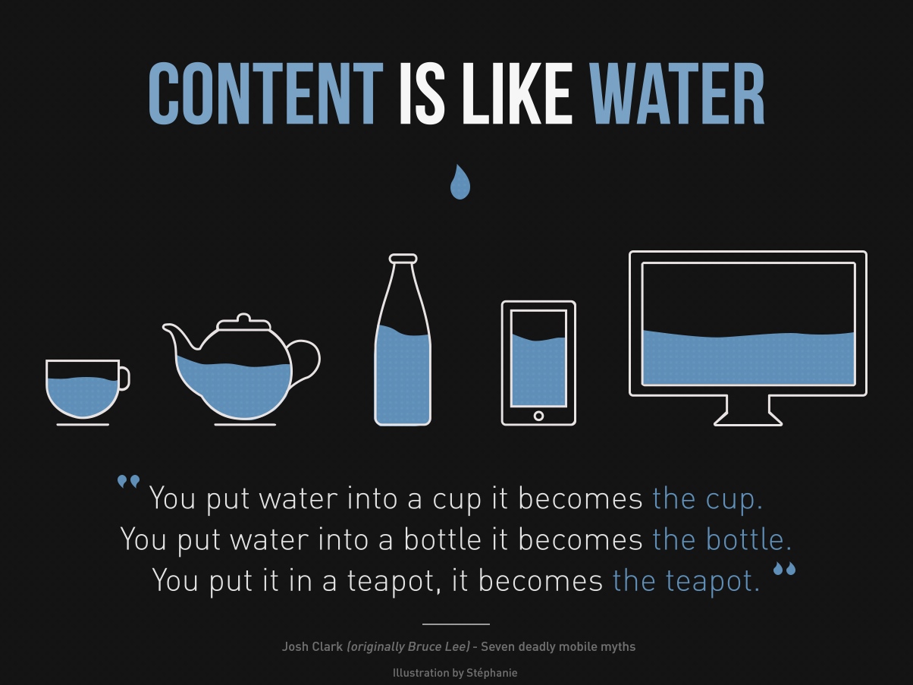

# CSS

CSS brings your website to life with custom styling. CSS itself is a style sheet language, used for describing how elements in your html should be presented.

## Default styles

When you write html:

```html
<html>
  <head></head>
  <body>
    <h1>Taco Ipsum</h1>
    <!-- Taco Ipsum is fun placeholder text with random words -->
    <p>
      Every day is <strong>taco ipsum tuesday</strong>. Tacos, again? This will
      be 5 times this week and it’s only Tuesday. Fish tacos with cabbage slaw
      and a side of chips and guac. I think I’ve overdosed on tacos. Can you put
      some peppers and onions on that? Ooh
    </p>
  </body>
</html>
```

And preview it in your browser:


You will find default styles already applied. The heading appears larger, the strong appears bold, and more. Each browser has their own defaults, which are also called user agent stylesheets. This way, when a browser loads html without css, it renders the html with minimal styling instead of just a long line of text.

When you open your developer tools under the `Elements` tab, take a look at the `Styles` tab:


The `Computed` tab shows the computed css properties of the html element, even if they were unspecified:


### CSS Resets

While user agent stylesheets are more standardized now, there are still differences between browsers. Many projects begin with a CSS file to reset or standardize the browser styles. It is up to you whether you want to simply standardize your starting point with [Normalize CSS](https://necolas.github.io/normalize.css/), or reset and clear the defaults with [Eric Meyer’s CSS Reset](https://meyerweb.com/eric/tools/css/reset/). You can also add defaults for other features, like OTF fonts with [Normalize-OpenType.css](https://github.com/kennethormandy/normalize-opentype.css). When using a css framework with prebuilt styles, like Bootstrap or Tailwind, a css reset is already applied for you.

## Linking custom css

### Plugins

For this section, follow along in your code editor of choice. Feel free to use VS Code (with [LiveServer](https://marketplace.visualstudio.com/items?itemName=ritwickdey.LiveServer) to automatically refresh the browser to see your changes) or an online service like [CodeSandbox](https://codesandbox.io/).

### Syntax

```css
/* this entire block is called a css ruleset */
selector {
  /* a css declaration is made of a property and its values */
  property: values;
  color: rebeccapurple;
}
```

### Inline styles

You can write styles inside of your html tags:

```html
<!DOCTYPE html>
<html lang="en">
  <head>
    <meta charset="UTF-8" />
    <meta name="viewport" content="width=device-width, initial-scale=1.0" />
    <title>Document</title>
  </head>
  <body>
    <h1 style="color: rebeccapurple; text-decoration: underline;">
      Taco Ipsum Tuesday
    </h1>
  </body>
</html>
```

### Style tags

HTML style tags contains css styles:

```html
<!DOCTYPE html>
<html lang="en">
  <head>
    <meta charset="UTF-8" />
    <meta name="viewport" content="width=device-width, initial-scale=1.0" />
    <title>Document</title>
    <style>
      h1 {
        color: rebeccapurple;
        text-decoration: underline;
      }
    </style>
  </head>
  <body>
    <h1>Taco Ipsum Tuesday</h1>
  </body>
</html>
```

### Style sheet

Create a file called `main.css` next to your `index.html` file. Inside your css file, write your styles.

```css
h1 {
  color: rebeccapurple;
  text-decoration: underline;
}
```

Link to your stylesheet inside your html file

```html
<!DOCTYPE html>
<html lang="en">
  <head>
    <meta charset="UTF-8" />
    <meta name="viewport" content="width=device-width, initial-scale=1.0" />
    <title>Document</title>
    <link href="main.css" rel="stylesheet" />
  </head>
  <body>
    <h1>Taco Ipsum Tuesday</h1>
  </body>
</html>
```

Using separate CSS files is the most common way to write custom styles. However, the other ways may come in handy.

## Selectors

In order to html elements with css, you must select them. CSS has a variety of selectors to target the html elements you would like to style. Let’s take a look at common selectors:

```css
/* This is a css comment */

/* element selector, all h1 tags */
h1 {
  color: rebeccapurple;
  text-decoration: underline;
}
/* class selector */
.class-name {
  color: aqua;
  font-size: 64px;
}
/* id selector */
#id-name {
  color: green;
  font-family: sans-serif;
}
```

In order to use class and element selectors, you must have matching class and id attribute in html:

```html
<!DOCTYPE html>
<html lang="en">
  <head>
    <meta charset="UTF-8" />
    <meta name="viewport" content="width=device-width, initial-scale=1.0" />
    <title>Document</title>
    <link href="main.css" rel="stylesheet" />
  </head>
  <body>
    <h1 class="class-name" id="id-name">Taco Ipsum Tuesday</h1>
  </body>
</html>
```

CSS classes can be applied to as many elements as you like, while an id can only be applied to a single html element. When possible, use classes.

There are many types of css selectors. To learn more, check out this [cheat sheet](https://gist.github.com/magicznyleszek/809a69dd05e1d5f12d01).

Unfortunately, no css selector can target the parent of an element.

## Cascade

CSS styles cascade. In fact, CSS stands for Cascading Style Sheets. If multiple css styles are applied to an element, they will cascade together. If css styles conflict, css specificity will determine which styles are applied.

In the example above, the html element:

```html
<h1 class="class-name" id="id-name">Taco Ipsum Tuesday</h1>
```

Will be styled with declarations from all the rulesets:

```
color: green;
text-decoration: underline;
font-size: 64px;
font-family: sans-serif;
```

Resulting in:


## Specificity

When multiple selectors target the same html element, specificity determines which styles get applied. Specificity is determined by the css selector, with each given a priority level: inline styles, id, classes, element, and more. If two selectors have the same specificity, the last one in the code applies.


_Credit to [specifishity.com](https://specifishity.com/)_

You can see which styles are being overridden using your browser developer tools:


If you are unsure about the specificity of a css selector, try this [online calculator](https://specificity.keegan.st/). Using `!import` will override specificity:

```css
h1 {
  color: rebeccapurple !important;
}
```

Use `!important` sparingly.

## Inheritance

Consider this html:

```html
<p>Taco <em>Ipsum</em> Tuesday</p>
```

If we style it with this css:

```css
p {
  color: green;
}
```

The word `Ipsum` will inherit the text color and become green. Learn more about which css properties are [inherited](https://developer.mozilla.org/en-US/docs/Web/CSS/Inheritance).

## Box model

In html, every element is a box. We’ve seen the box model already in our developer tools, we just not might have recognized it:


The box is composed of layers: margin, border, padding, and content. All of these add together to form the element’s dimensions.

### Box sizing

Consider this element:

```css
.box {
  width: 100px;
  height: 100px;
  padding: 10px;
  border: 5px solid black;
  margin: 20px;
}
```


The element dimensions will be 130px with 20px margin all around.

```
element width = left border + left padding + width + right padding + right border

content width = width
```

Adding padding and border together for the element dimensions is tedious, but the css `box-sizing: border-box;` makes it easy. This rule means that the padding and border will be calculated by subtracting it from the content width and height. Now the element dimensions are 100px with 20px margin around it, even with 10px padding and 5px border.

```
element width = width

content width = width - left border - left padding - right padding - right border
```

Many css resets apply this box sizing rule to every html element for you.

### Margin collapse

Be aware that margins collapse when they collide. If an element has a `margin-bottom: 20px;` and the element below it has a `margin-top: 30px;` the gap between them will collapse and be 30px, not 50px. Try to use padding when possible.

## Units

CSS units in production sites depend on their context. For this curriculum, you may use pixels for everything.

Feel free to try em in media queries and rem for font sizes. Calculate em and rem assuming the base size of 16px.

To set an element to be the full width of a screen, use `width: 100%;` and ensure all ancestors have the same width without margin or padding.

To set an element to be the full height of a screen, use `height: 100vh;`.

It is possible to use the calc function to perform calculations in css, for example `width: calc(100vh - 60px);`.

### Resolution

Just because an image is sized 50px by 50px in your webpage does not mean the image should be 50px tall and 50px wide. You should also consider screen resolution. The resolution (dpi dots per inch / ppi pixels per inch) of a standard monitor is 72dpi, a retina Mac is 144dpi, and some phones may be even higher resolution. On a retina screen, your image should be 100px by 100px to compensate for doubling the resolution. I recommend using a framework that handles image resolution and resizing for you.

#### Vector vs raster

The most common raster graphics are photographs—zoom in enough, and you’ll see pixels. Vector graphics are like logos, fonts, and icons—defined by math, they will stay sharp no matter their size. Prefer vector formats (like svg) when possible.

## Layout

The two main ways of creating layouts in css are built on the position and display properties. In this curriculum, we will not cover floats.

### Display

#### Block, Inline, Inline-block


_Credit [Stack Overflow](https://stackoverflow.com/a/9189873)_

Common elements with these defaults:

```css
h1 {
  display: block;
}
strong {
  display: inline;
}
button {
  display: inline-block;
}
```

Elements with display block (h1, p, etc.) will take the full width of the container by default, forcing adjacent elements to start on a new line. Inline elements (such as strong, em, span, etc.) will allow elements to sit beside them, but will not respect top and bottom margin and padding. Inline-block elements (such as buttons) will respect margin and padding, while also allowing other elements to sit next to them.

#### Flexbox

To learn flex box, we recommend completing at least two of these resources:

- https://flexboxfroggy.com/
- https://flexbox.io/
- https://scrimba.com/learn/flexbox
- https://tympanus.net/codrops/css_reference/flexbox/
- https://css-tricks.com/snippets/css/a-guide-to-flexbox/

#### Grid

To learn css grid, we recommend completing at least two of these resources:

- https://cssgridgarden.com/
- https://cssgrid.io/
- https://scrimba.com/learn/R8PTE
- https://tympanus.net/codrops/css_reference/grid/
- https://css-tricks.com/snippets/css/complete-guide-grid/

### Position

#### Static, Relative, Absolute

- https://alistapart.com/article/css-positioning-101/
- https://www.freecodecamp.org/news/how-to-use-the-position-property-in-css-to-align-elements-d8f49c403a26/

#### z-index

- https://codeburst.io/z-index-is-not-voodoo-bro-24bbe4d6d997
- https://www.smashingmagazine.com/2009/09/the-z-index-css-property-a-comprehensive-look/
- https://www.digitalocean.com/community/tutorials/css-z-index

## Media queries

```css
/* Change the page (body element) background based on the environment */
body {
  background-color: blue;
}

/* Change the h1 font size based on screen width */
h1 {
  font-size: 2em;
}

@media screen and (min-width: 640px) {
  body {
    background-color: lightblue;
  }
  h1 {
    font-size: 4em;
  }
}

@media print {
  body {
    background-color: white;
  }
}

@media (prefers-color-scheme: dark) {
  body {
    background-color: black;
  }
}
```

Media queries are used to change site styling depending on the device type, size, or characteristics.


_Credit [Stéphanie Walter](https://stephaniewalter.design/blog/download-illustration-content-is-like-water/)_

For example, text may be smaller on mobile and larger on desktop. Desktops may have three columns, while mobile reflows into a single column. A website should have a background color, while a print version should be black and white.

Media queries help us make the right decisions for the right environment.

### Mobile first

Mobile first is a design principle that embraces starting with the most restricted mobile version first, and then expanding features in tablet and desktop versions. Due to increasing mobile usage and sales, more and more users are likely to view your site from a phone.

CSS frameworks, like Tailwind, embrace the mobile first approach for styling responsive sites.

## Frameworks

CSS Frameworks help developers via standardization.

- Avoid reinventing the wheel and writing css from scratch
- Avoid cross-browser bugs and inconsistencies
- Follow consistent best practices

Some frameworks, like Bootstrap, give you pre-styled components out of the box—like buttons. However, these components are hard to customize and often build websites that look very similar.

```html
<button class="btn btn-primary">Click me</button>
```

Other frameworks, like Tailwind, give you a consistent set of classes for you to build your own components. They excel in customization and creating unique designs. When you need speed, prebuilt components for Tailwind can also be found online.

```html
<button class="bg-blue-700 px-3 py-2 outline-none rounded text-white">
  Click me
</button>
```

We will learn more about Tailwind CSS in the next article.

## The holy grail


_Credit [Wikipedia](https://bit.ly/386It2a)_

Before CSS Grid and Flexbox, the holy grail was near impossible to create. Now, with modern web technologies, you too can implement this layout.

## Practice

- Holy grail in flexbox
- Holy grail in css grid

## Optional

- Centering in css
- Overflow and line clamping
- CSS Floats
- BEM
- CSS Frameworks
  - Bootstrap
  - Material UI
  - Tailwind CSS
- CSS Corner ribbon
- CSS Animation
- CSS Modules
- CSS in JS
- CSS Caching
- Relative and absolute link paths

## [Next lesson →](./09-tailwindcss.md)
