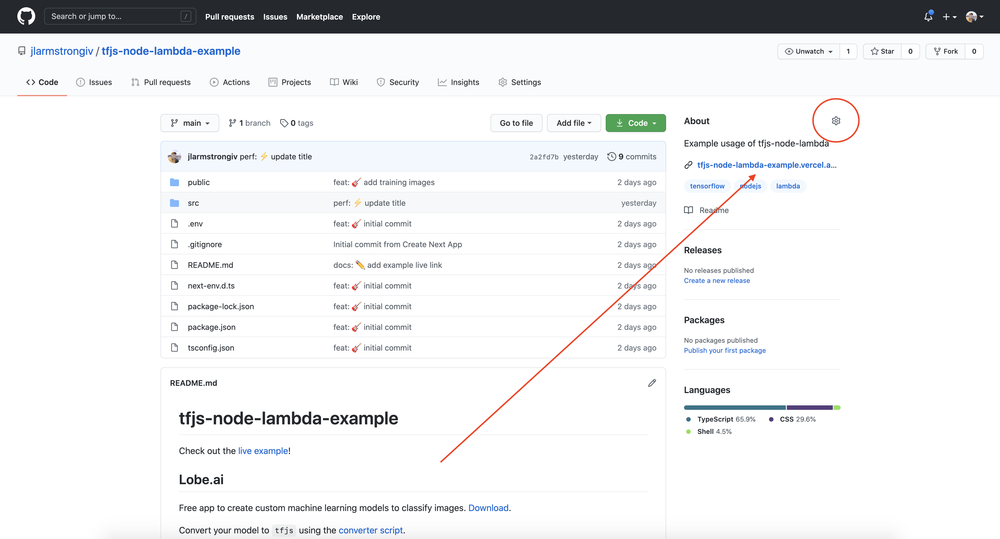

# surge.sh

Once you’ve built your website on your local machine, you will need to host it online for others to view it on the internet. To deploy your intro to web development websites online, we will use surge.sh as our website hosting provider. Watch the video or follow the commands below:

[](https://www.youtube.com/watch?v=-EjdMvYPSVU)
_Surge on [YouTube](https://www.youtube.com/watch?v=-EjdMvYPSVU)_

Install surge with npm:

```bash
npm install --global surge
```

Login or create an account:

```bash
surge login
```

Publish your project:

```bash
surge --domain your-name.surge.sh
```

If your site is in a nested folder:

```
npx surge --domain your-name.surge.sh --project ./dist
```

Publish your code publicly to GitHub. Add the link to your project under `About > Repository Details (gear icon) > Website`.



## Practice

Publish all of your previous projects with surge, and add the surge links to your projects’ GitHub descriptions.

## Optional

- [Vercel](https://vercel.com/)
- [GitHub Pages](https://www.npmjs.com/package/gh-pages#command-line-utility)

## [Next lesson →](./12-conclusion.md)
